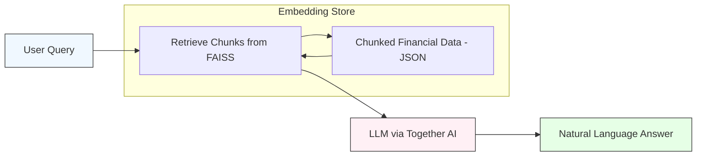

# 🍟 QSR Dashboard — AI-Powered Financial Insights for Restaurants


An interactive, AI-enhanced dashboard for visualizing and analyzing Quick Service Restaurant (QSR) financial performance across stores, regions, and time. Built with Dash and powered by a custom Retrieval-Augmented Generation (RAG) system for natural language querying.

---
<details>
<summary>Click to view Mermaid code</summary>


</details>


---

## 🚀 Key Features

- **Dynamic Financial Dashboard**  
  Visualize KPIs like revenue, cost of sales, and EBITDA across periods, regions, area coaches, and stores.

- **Modular Views**  
  - Summary view with top KPIs and waterfall chart  
  - Revenue, cost of sales, and payroll breakdowns  
  - Store-level and regional comparisons

- **Ask AI: RAG-Based Chatbot**  
  - Natural language Q&A over store financial data  
  - Powered by Together AI and FAISS for accurate, context-aware answers  
  - Built-in chunking and retrieval on structured JSON data

- **Fully Interactive**  
  - Dropdown filtering  
  - Responsive charts and tables  
  - Auto-generated insights based on selections

---

## 🧠 Tech Stack

- **Frontend & Framework**: Dash, Plotly, Dash Bootstrap Components
- **Backend**: Flask, Gunicorn, FAISS
- **LLM Integration**: Together AI via API
- **Embedding**: Sentence Transformers
- **Data Handling**: Pandas, NumPy
- **Deployment**: Procfile + Gunicorn
- **Env Config**: python-dotenv

---

## 📦 Project Structure

```protobuf
📁 Data/
│ ├── all_store_data_region.json
│ └── rag_chunks/
│ ├── store_chunks.jsonl
│ ├── financial_index.faiss
│ ├── texts.pkl
│ └── metadata.pkl
📁 callbacks/
📁 components/
📁 rag_together/
📁 utils/
├── main.py
├── requirements.txt
├── Procfile
├── .env
└── README.md
```


---

## ⚙️ Setup & Installation

### 1. Clone the Repository
```bash
git clone https://github.com/aryanj10/dashboard.git
cd dashboard
```

### 2. Create and Activate Virtual Environment
```bash
python -m venv venv
source venv/bin/activate    
# On Windows: venv\Scripts\activate
```

### 3. Install Requirements
```bash
pip install -r requirements.txt
```

### 4. Add Environment Variable
Create a .env file:
```env
TOGETHER_API_KEY=your_together_api_key
```

### 5. Preprocess Data for RAG

```bash
python rag_together/rag_code.py
```
If needed, create the FAISS index:

```bash
python rag_together/Faiss_indexing.py
```

### 6. Run the App

**➤ Development**
```bash
python main.py
```
Visit: http://localhost:7000/

**➤ Production (Gunicorn)**
```bash
gunicorn main:server
```

---

 ## AI Chat — How It Works

- Financial JSON is converted to text chunks.

- Chunks are embedded using Sentence Transformers.

- FAISS indexes embeddings for fast retrieval.

- On a query, the most relevant chunks are retrieved.

- Together AI LLM answers the question based on those chunks.

---

## 🙌 Acknowledgments

- Together AI for free LLM API access

- Dash community for open-source components

- FAISS and Sentence Transformers for powering semantic search

---
